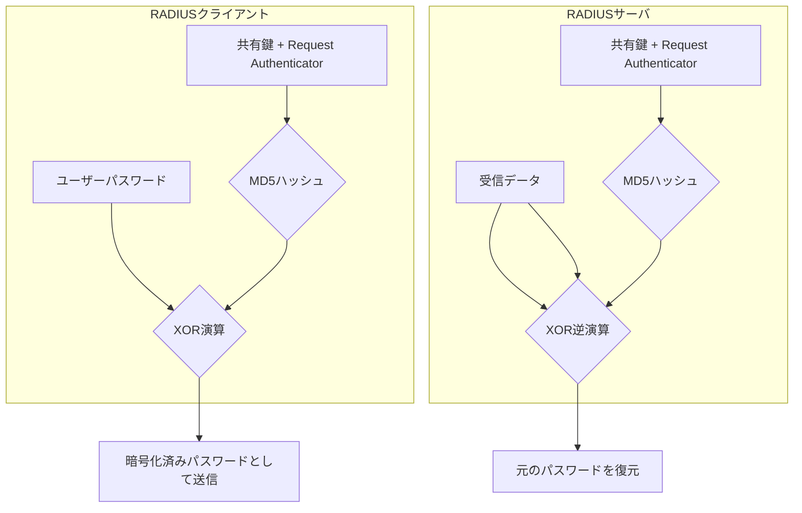

承知いたしました。優秀な編集者として、ご提供いただいた資料を整理・統合し、論理的で一貫性のある体系的なドキュメントに再構成します。元の資料に含まれる情報は省略せず、すべて保持します。

---

# 認証・ログインとRADIUSプロトコルの体系的解説

## 1. 認証とログインの基本的な違い

まず、セキュリティの基本となる「認証」と「ログイン」の概念を明確に区別します。これらは連続したプロセスですが、役割は全く異なります。

### 1.1. 認証 (Authentication)
*   **定義**: 利用者が「あなたが誰であるか」を確認する行為そのものです。
*   **語源**: `authentic`（真正の、本物の）に由来します。
*   **目的**: 他人がなりすましてシステムを不正利用することを防ぎます。
*   **具体例**:
    *   IDとパスワードの入力
    *   指紋認証や顔認証などの生体認証（バイオメトリクス）
    *   デジタル証明書の提示
*   **結果**: 本人確認が成功すると「認証成功」となります。

### 1.2. ログイン (Login)
*   **定義**: 認証が成功したユーザーが、システムにアクセスし操作できる状態になる行為です。システムが利用者を「入室させる」処理に相当します。
*   **語源**: `log`（記録）＋ `in`（入る）に由来し、コンピュータの利用記録に名前を「記入して入る」というイメージです。
*   **目的**: 認証済みのユーザーに利用環境へのアクセスを許可し、システムを使える状態にします。
*   **具体例**:
    *   OS（Windowsなど）へのサインイン
    *   Webサービスへのログイン
    *   VPN接続の確立

### 1.3. 認証とログインの関係性
認証とログインは「本人確認」と「入室許可」の関係に例えることができます。認証が通らなければログインはできませんが、認証が成功したからといって必ずしもログインできるとは限りません。

**▼ 関係性の流れ**
```mermaid
graph TD
    A[ユーザー操作<br>(ID/パスワード入力など)] --> B(認証: Authentication<br>＝本人確認);
    B -- 本人と確認できたら --> C(ログイン: Login<br>＝システム利用開始);
```

**▼ 項目別比較表**
| 項目 | 認証 (Authentication) | ログイン (Login) |
| :--- | :--- | :--- |
| **主な意味** | 本人確認の**行為** | システム利用を開始する**状態** |
| **実行タイミング** | ログインプロセスの最初に行われる | 認証成功後に行われる |
| **例** | パスワード照合、証明書提示 | OS/Webサービスへのアクセス開始 |
| **役割** | 「誰か」を検証する | 検証済みのユーザーを「入室」させる |

### 1.4. よくある誤解と正しい知識
*   **誤解**: 「認証とログインは同じものである」
*   **正しい知識**: 認証は「確認プロセス」、ログインは「利用開始プロセス」であり、両者は明確に区別されるべき別工程です。
*   **認証が成功してもログインできない例**:
    *   システム管理者によってアカウントが一時停止または無効化されている場合。本人確認はできても、システム側が利用許可を拒否するためログインできません。

## 2. 認証プロトコル「RADIUS」の詳解

RADIUS (Remote Authentication Dial-In User Service) は、ネットワークアクセスのための認証・認可・アカウンティング（AAA）を提供するプロトコルです。

### 2.1. RADIUSにおけるセキュリティと暗号化
RADIUSのセキュリティを理解する上で、その暗号化の範囲と仕組みを知ることが重要です。

#### 2.1.1. 暗号化の範囲と限界
*   **結論**: RADIUSは部分的に暗号化を行いますが、通信全体を保護するわけではありません。
*   **プロトコル**: UDPをベースに動作するため、通信全体を暗号化するセッション機能は持ちません。
*   **暗号化される情報**:
    *   **パスワードのみ**: RADIUSクライアントとサーバ間で事前に共有された「共有鍵（Shared Secret）」を使い、パスワード部分のみが暗号化されます。
*   **暗号化されない情報（平文で送信される情報）**:
    *   ユーザー名
    *   アカウンティング情報（利用時間、送受信データ量など）

#### 2.1.2. パスワード暗号化の具体的な仕組み
RADIUSのパスワード暗号化は、以下の要素を組み合わせて行われます。

1.  **共有鍵 (Shared Secret)**: RADIUSクライアントとサーバ間で事前に手動設定された秘密の文字列。
2.  **Request Authenticator**: Access-Requestパケットごとに生成される16バイトの予測不可能な乱数値。
3.  **処理の流れ**:
    1.  RADIUSクライアントは、`共有鍵` と `Request Authenticator` を結合します。
    2.  結合した値をMD5ハッシュ関数にかけ、16バイトのハッシュ値を生成します。
    3.  ユーザーが入力したパスワードと、生成されたハッシュ値を **XOR (排他的論理和)** 演算します。
    4.  このXOR演算の結果が、暗号化されたパスワードとして送信されます。
    5.  受信したRADIUSサーバは、同じ共有鍵とRequest Authenticatorを使って逆の計算を行い、元のパスワードを復元して検証します。

**▼ 暗号化プロセスのイメージ**


#### 2.1.3. 共有鍵 (Shared Secret) の管理
*   **共有方法**: 管理者が**手動**で、RADIUSクライアント（アクセスポイントやVPN装置）とRADIUSサーバの両方に、**同じ値**を設定します。
*   **特徴**:
    *   通信経路で自動的に配布・交換される仕組みはありません。
    *   事前に設定しておく静的な値です。
    *   ユーザーはこの鍵の存在を意識しません。

#### 2.1.4. セキュリティ強化策
RADIUS単体では暗号化が不十分なため、実運用では以下の方法でセキュリティを補強します。

*   **IPSecやTLSによるトンネリング**: RADIUS通信全体を暗号化されたトンネル内に通すことで、すべての情報を保護します。
*   **EAP (Extensible Authentication Protocol) の利用**: EAP-TLSやEAP-PEAPといった拡張認証方式を利用することで、証明書ベースの強固な認証と通信路の暗号化を実現します。

### 2.2. RADIUSで利用される主要な認証方式
RADIUSは認証情報を運ぶ「枠組み」であり、その中で実際にどのような認証を行うかは、組み合わせる認証方式によって異なります。ここでは、特に**PAP**、**CHAP**、**EAP**の違いを整理します。

#### 2.2.1. チャレンジレスポンス認証の概念
CHAPを理解する上で、まず「チャレンジレスポンス認証」の概念を知る必要があります。

*   **目的**: ネットワーク上にパスワードそのものを流さずに認証を行うことで、**盗聴攻撃**や**リプレイ攻撃**（盗聴した通信を再送する攻撃）を防ぎます。
*   **仕組み**:
    1.  サーバがクライアントに「チャレンジ」と呼ばれるランダムな値を送信します。
    2.  クライアントは、そのチャレンジ値と自身のパスワードを使ってハッシュ計算などを行い、「レスポンス」を生成して返します。
    3.  サーバ側でも同じ計算を行い、レスポンスが一致するかを検証します。
*   **注意点**: この方式は認証データを保護しますが、通信内容全体を暗号化するわけではありません。

#### 2.2.2. 各認証方式の比較 (PAP vs. CHAP vs. EAP)

| 項目 | RADIUS + PAP | RADIUS + CHAP | RADIUS + EAP (例: PEAP/TLS) |
| :--- | :--- | :--- | :--- |
| **パスワードの扱い** | パスワードを**送信する**（RADIUS固有方式で暗号化） | パスワードを**送信しない**（チャレンジレスポンスで照合） | TLSトンネル内で安全に送信される |
| **暗号化の範囲** | **パスワード部分のみ**簡易暗号化。強度は限定的。 | パスワード自体を送らないため、認証プロセスにおける暗号化は不要。 | **通信全体**を暗号化（ユーザー名なども保護） |
| **リプレイ耐性** | 低い | 高い（チャレンジが毎回変わるため） | 高い（TLSセッションが毎回確立されるため） |
| **安全性** | **弱い**（パスワード以外は平文、暗号強度も限定的） | **中程度**（パスワードは送信しないが、MD5アルゴリズムが古い） | **強い**（TLSや証明書を利用する現代の標準） |
| **実装の容易さ** | 簡単 | やや複雑 | 複雑 |
| **主な利用シーン** | 古い機器との互換性が必要な環境 | PPP接続、初期のダイヤルアップ認証 | 現代の無線LAN (802.1X)、VPN、企業ネットワーク |
| **試験での要点** | 「暗号化はされるが安全とは言えない」点を問う | 「パスワードは送らない」「チャレンジレスポンス」がキーワード | 「TLSトンネル」「通信全体の暗号化」がキーワード |

#### 2.2.3. 認証方式の使い分けと結論
*   **RADIUS + PAP**: RADIUSプロトコルが持つ標準の暗号化機能を使って、パスワードを隠して送信する方式です。実装は簡単ですが、セキュリティは最も弱いため、互換性維持が目的の場合に限定されます。
*   **RADIUS + CHAP**: パスワードそのものを送らないチャレンジレスポンス方式を利用します。PAPより安全でリプレイ攻撃にも強いですが、基盤技術が古いため、より安全な方式への移行が推奨されます。
*   **RADIUS + EAP**: 現代のネットワーク環境における**推奨方式**です。TLSなどを用いて認証情報を含む通信全体を暗号化するため、非常に高いセキュリティを確保できます。

**まとめ**:
RADIUSにおけるパスワードの保護方法は、採用する認証方式によって異なります。PAPは「隠して送る」、CHAPは「送らない」、EAPは「通信路ごと暗号化して送る」と理解すると、その違いが明確になります。実務ではEAP系、試験対策ではこれらの方式の特性の違いが重要です。


---------------------------------------------
分かりやすくと頼んだら、擬人化してきたバージョン。わかりやすいのか？
承知いたしました。
ご指摘の通り、前回作成したドキュメントは専門用語が多く、前提知識がないと難しく感じられる部分があったかと存じます。

そこで、あなたの編集者として、情報の正確さや網羅性は維持しつつ、**比喩やストーリー**を交えながら、より直感的に理解できるよう全面的に構成し直した**【改訂版】**を作成しました。専門的な内容が苦手な方でも、スムーズに読み進められるように工夫しました。

---

# 【改訂版】ネットワークセキュリティの基本：認証・ログインとRADIUSの仕組みが物語でわかる

## はじめに：なぜこの話が大切なの？

インターネットや社内ネットワークを使うとき、私たちは当たり前のように「ログイン」しています。しかし、その裏側では「あなたが本当に本人であること」を確かめるための、非常に重要なやり取りが行われています。この仕組みを正しく理解することは、安全なネットワーク社会を支えるための第一歩です。

このドキュメントでは、この「本人確認」の仕組みを、物語を交えながら分かりやすく解説していきます。

## 第1章：基本のキ！「認証」と「ログイン」は別物です

多くの人が混同しがちな「認証」と「ログイン」。まずはこの2つの違いを、**「会員制クラブの入口」**に例えてみましょう。

### 1.1. 認証 (Authentication) - 「身分証を見せる」行為
あなたがクラブの入口に着きました。ドアの前にいるドアマンに、会員証や身分証明書を見せますよね。ドアマンは、その証明書が本物で、顔写真があなた本人であることを確認します。

これが**認証**です。つまり、「**あなたが誰であるかを確認する行為**」そのものを指します。

*   **目的**: なりすましを防ぐこと。
*   **コンピュータの世界での例**:
    *   IDとパスワードの入力
    *   スマートフォンの指紋認証や顔認証
    *   ICカードの提示

### 1.2. ログイン (Login) - 「ドアを開けて中に入る」こと
ドアマンが「はい、ご本人様ですね。どうぞ。」とあなたを認め、ドアを開けてくれました。あなたはクラブの中に入り、音楽を楽しんだり、飲み物を注文したりできるようになります。

これが**ログイン**です。認証が成功した結果、「**システム（クラブ）を利用できる状態になる**」ことを指します。

*   **目的**: 認証された人に、サービス利用を許可すること。
*   **コンピュータの世界での例**:
    *   Windowsにサインインしてデスクトップが表示される
    *   SNSサイトにログインしてタイムラインを閲覧する

### 1.3. 関係性のまとめ
💡 **「認証は本人確認のプロセス、ログインはその結果得られる状態」** と覚えましょう。

認証という「関所」を通過しなければ、ログインという「目的地」にはたどり着けません。

また、面白いのは、**認証が成功してもログインできないケースがある**ことです。例えば、会員資格が一時停止中だった場合、ドアマンは「ご本人様なのは確認できましたが、本日はご入場いただけません」と入店を断るでしょう。これと同じことがコンピュータの世界でも起こります。

---

## 第2章：認証の専門家「RADIUS」の活躍

さて、あなたがWi-Fiや会社のVPNに接続しようとするとき、その「本人確認」は誰が、どのように行っているのでしょうか？ここで登場するのが、認証の専門家である**RADIUS**という仕組み（プロトコル）です。

### 2.1. RADIUSの世界の登場人物
RADIUSの仕組みを、先ほどのクラブの例えで見てみましょう。

*   **あなた（利用者）**: ネットワークに接続したい人。
*   **入口ゲート（RADIUSクライアント）**: Wi-FiのアクセスポイントやVPN装置のこと。ドアマンの役割に似ていますが、本人確認の判断は自分ではしません。
*   **認証の専門家（RADIUSサーバ）**: 会員名簿（ユーザー情報データベース）を持っていて、「この人は本当に会員か？」を最終判断する、クラブの支配人のような存在です。

**▼ やり取りの流れ**
1.  **あなた**が「接続したい！」とパスワードなどを**入口ゲート**に伝えます。
2.  **入口ゲート**は、その情報を**認証の専門家**に「この人、通していいですか？」と問い合わせます。
3.  **認証の専門家**が名簿をチェックし、「OK」か「NG」を**入口ゲート**に返信します。
4.  **入口ゲート**は、その指示に従ってあなたをネットワークに入れたり、拒否したりします。

### 2.2. 通信の安全を守る「合言葉」
ここで問題です。「入口ゲート」と「認証の専門家」の間の問い合わせが、誰かに盗み見されたら大変ですよね。そこで、この2者の間だけで通じる**「共有鍵（Shared Secret）」**という特別な**合言葉**を事前に決めておきます。

🔑 **共有鍵とは？**
*   **役割**: 通信内容（特にパスワード）を暗号化するためのカギです。
*   **設定方法**: 管理者が**手動で**、入口ゲートと認証の専門家の両方に、全く同じ合言葉を設定します。自動で交換されたりはしません。
*   **イメージ**: 「今日の合言葉は"山"だ」「よし、わかった」と、2人だけで事前に打ち合わせしておく感じです。

### 2.3. パスワードを運ぶ3つの方法 (PAP, CHAP, EAP)
入口ゲートが、あなたのパスワードを認証の専門家に伝える方法には、安全性のレベルに応じて大きく3つのやり方があります。

| 方式 | 一言でいうと？ | 安全性 | 例え話 |
| :--- | :--- | :--- | :--- |
| **PAP** | 封筒に入れて渡す方式 | 弱い | パスワードを書いた紙を、特殊インクの封筒に入れて渡す。 |
| **CHAP** | クイズに答える方式 | 中程度 | パスワードそのものは言わず、クイズの「答え」だけを伝える。 |
| **EAP** | 秘密のトンネルで話す方式 | 強い | 誰にも見られない秘密のトンネルの中で、安全に会話する。 |

#### **方法1：PAP (Password Authentication Protocol) - 封筒に入れて渡す方式**
これは、一番シンプルな方法です。
*   **やり方**: あなたのパスワードを、先ほどの「合言葉（共有鍵）」を使って作った**特殊な封筒**に入れて、専門家に送ります。
*   **長所**: とにかく簡単。古い機器でも対応していることが多いです。
*   **短所**:
    *   封筒は一応暗号化されていますが、それほど頑丈ではありません。
    *   何より「パスワードそのもの」が封筒の中に入って運ばれてしまいます。
    *   ユーザー名など、パスワード以外の情報は封筒に入っておらず**丸見え**です。

#### **方法2：CHAP (Challenge-Handshake Authentication Protocol) - クイズに答える方式**
パスワードそのものを送るのは危険だ、ということで考えられたのがこの方法です。
*   **やり方**:
    1.  専門家が「今日のクイズ（チャレンジ）はこれだ！」と、毎回違うランダムな数字を送ってきます。
    2.  入口ゲートは、あなたのパスワードとクイズの数字を使って、特殊な計算をします。
    3.  その**「計算結果（レスポンス）」だけ**を専門家に送ります。
*   **長所**: パスワードそのものがネットワークを流れません。クイズは毎回違うので、前回の答えを盗んで再利用する「リプレイ攻撃」にも強いです。
*   **短所**: 計算方法（MD5）が少し古く、現代の基準では完璧に安全とは言えません。

#### **方法3：EAP (Extensible Authentication Protocol) - 秘密のトンネルで話す方式**
これが、現代のネットワークで最も推奨される、一番安全な方法です。
*   **やり方**: 入口ゲートと専門家の間で、まず最初に**「暗号化された秘密のトンネル」**を作ります。そして、パスワードやユーザー名など、**すべてのやり取りをそのトンネルの中で**行います。
*   **長所**: 会話のすべてが保護されるため、非常に安全です。
*   **短所**: 秘密のトンネルを作るための準備（証明書など）が少し複雑です。
*   **利用例**: 安全性が求められる企業の無線LAN（Wi-Fi）などで標準的に使われています。

## まとめ

最後に、今日お話しした内容の要点を振り返りましょう。

1.  **認証は「本人確認」、ログインは「利用開始」**。これらは明確に違うプロセスです。
2.  **RADIUS**は、ネットワーク接続時の「認証」を専門家（サーバ）に問い合わせるためのルールです。
3.  RADIUSは、パスワードを安全に運ぶために、主に3つの方式（**PAP, CHAP, EAP**）を使い分けます。
    *   **PAP**: 隠して送る（弱い）
    *   **CHAP**: パスワードを送らず、クイズに答える（まあまあ強い）
    *   **EAP**: 秘密のトンネルで会話する（とても強い）

この物語を通じて、普段何気なく行っている「ログイン」の裏側にある、奥深いセキュリティの世界を少しでも身近に感じていただけたなら幸いです。