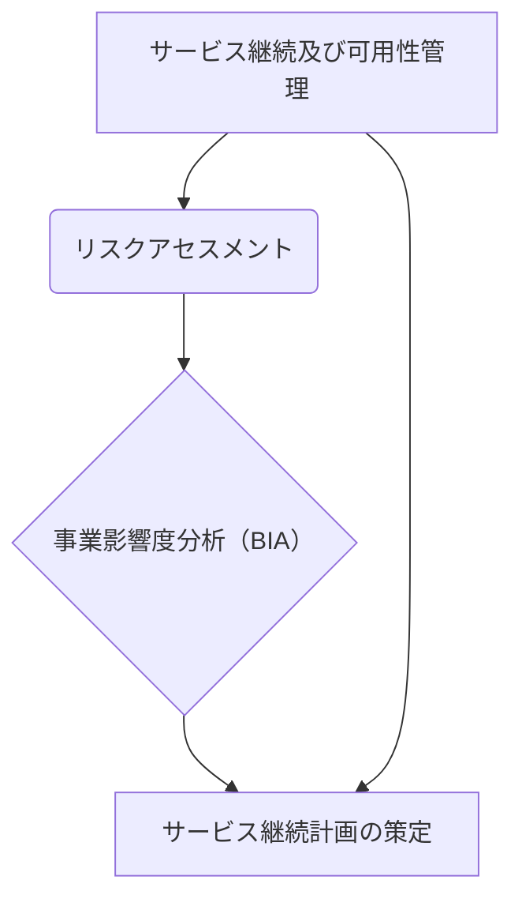

---

## ITサービスマネジメント：事業影響度分析（BIA）の実施プロセス

本文書は、ITサービスマネジメントにおける主要なプロセス、特に「事業影響度分析（BIA）」がどのプロセスに該当するのかを明確に解説します。情報処理技術者試験の問題を題材に、各プロセスの役割と相違点を整理し、知識の定着を図ることを目的とします。

### 1. 対象となる問題の概要（平成28年秋期 問56）

まず、議論の起点となる情報処理技術者試験の問題と解答を確認します。

#### 1.1. 問題
Tサービスマネジメントにおいて、災害による重大なサービス停止に関する**事業影響度分析**は、どのプロセスで実施するか。

#### 1.2. 選択肢
- ア. インシデント及びサービス要求管理
- イ. サービス継続及び可用性管理
- ウ. サービスレベル管理
- エ. 問題管理

#### 1.3. 正解とユーザーの解答
- **正解：イ**
- あなたの解答：ウ

---

### 2. 解説：なぜ「サービス継続及び可用性管理」が正解なのか

結論として、**事業影響度分析（BIA）**は「サービス継続及び可用性管理」プロセスの中核的な活動です。その理由と各用語の定義を解説します。

#### 2.1. サービス継続及び可用性管理とは
**サービス継続及び可用性管理**は、SLA（サービスレベル合意）で定められたサービスの継続性と可用性を確実に達成することを目的とするプロセスです。

このプロセスは、サービス障害や災害の**予防**と、発生してしまった場合からの**復旧**を確実にすることを目指します。

#### 2.2. 事業影響度分析（BIA）とは
**事業影響度分析（BIA: Business Impact Analysis）**は、災害やシステム障害などによる重大なサービス停止が、事業活動にどのような影響を与えるかを分析する活動です。

具体的には、影響の大きさや範囲、事業が耐えられるサービス停止時間（**許容停止時間**）などを明らかにします。英語の「Impact（影響）」を「Analysis（分析）」することから、この名称で呼ばれます。

#### 2.3. プロセスにおけるBIAの位置づけ
サービス継続及び可用性管理の主要な活動は、**リスクアセスメント**と**リスクマネジメント**です。

リスクアセスメントの一環として**事業影響度分析（BIA）**を実施し、その結果に基づいて、具体的な**サービス継続計画**（BCPに相当）が策定されます。この計画があることで、万一の事態にも適切な優先順位で対応できます。

---

### 3. 各プロセスの役割と違いの比較

この問題で誤答を誘う選択肢は、それぞれ異なる目的と役割を持っています。その違いを理解することが、知識の整理につながります。

#### 3.1. プロセス全体の体系マップ
各プロセスがサービスマネジメント全体の中でどのような役割を担っているかを比較します。

| プロセス名 | 主な役割・目的 | 災害・停止時の扱い（時間軸） |
| :--- | :--- | :--- |
| **サービス継続管理** | BIA・リスクアセスメント・計画策定 | **【事前】** 万一止まったらどう継続するか計画する |
| **サービスレベル管理** | SLAの合意・監視・報告・レビュー | **【平常時】** どの水準のサービスを提供するか合意する |
| **インシデント管理** | 障害の受付・復旧・サービス要求への対応 | **【事後・短期】** 発生した障害を迅速に復旧させる |
| **問題管理** | 根本原因の究明・恒久的な解決策の提案 | **【事後・長期】** なぜ障害が起きたかを分析し再発を防ぐ |

#### 3.2. サービスレベル管理（ユーザーが選択した誤答）
**サービスレベル管理**は、提供されるサービスの「定義」「合意」「文書化」「監視」「報告及びレビュー」を行うプロセスです。

- **よくある誤解**: BIAがSLA（サービスレベル合意）と関連があるように感じられるため、このプロセスを選んでしまいがちです。
- **正しい知識**: SLAはあくまで**平常時**のサービス提供水準を定めるものです。一方、BIAは**災害時など異常事態**における事業継続の可能性を分析する活動であり、「サービス継続管理」の領域です。

#### 3.3. インシデント及びサービス要求管理
**インシデント及びサービス要求管理**は、発生した全てのインシデント（サービス停止や品質低下）やサービス要求を、事業への影響度に応じて効果的かつ効率的に管理するプロセスです。**迅速な復旧**が主目的です。

#### 3.4. 問題管理
**問題管理**は、インシデントの根本原因を特定し、恒久的な解決策（パッチ適用、設計変更など）を提案するプロセスです。インシデント管理が「応急処置」なら、問題管理は「根本治療」にあたります。

---

### 4. 知識定着のための学習ポイント

同じ間違いを繰り返さないために、試験の着眼点やキーワードの関連付けを整理します。

#### 4.1. 試験における着眼点
- **キーワードの関連付け**:
  - 「**災害**」「**重大な停止**」「**事業影響度分析**」という言葉を見たら、即座に「**サービス継続管理**」を連想できるようにしましょう。
- **出題者が狙う誤答パターン**:
  - **SLA**という言葉から「サービスレベル管理」を連想させる。
  - **障害対応**という点で「インシデント管理」や「問題管理」と混同させる。
- **判断基準**:
  - その活動が「**事前の分析・計画**」なのか、「**事後の対応**」なのかを考えると、正解を絞り込めます。BIAは明らかに「事前」の活動です。

#### 4.2. 記憶定着のためのQ&A
- **Q1. 事業影響度分析（BIA）はどのプロセスで行う？**
  - A1. **サービス継続及び可用性管理**。災害による重大な停止の影響分析は、継続計画を作るための前提活動です。

- **Q2. インシデント管理と問題管理の違いは？**
  - A2. インシデント管理は「発生した障害の受付と復旧（**即応**）」、問題管理は「原因分析と恒久対策（**恒久**）」です。

- **Q3. BIAで具体的に何を分析する？**
  - A3. 業務停止が事業に与える**影響度**、事業が耐えられる**許容停止時間**、復旧の**優先順位**などです。

- **Q4. サービス継続管理の主な成果物は？**
  - A4. **サービス継続計画**（BCP: Business Continuity Plan に相当）。災害時にどのようにサービスを復旧・継続させるかを文書化したものです。

#### 4.3. 要約
- **事業影響度分析（BIA）**は、「**サービス継続及び可用性管理**」プロセスで実施される。
- その目的は、災害時の業務停止が事業に与える影響を**事前に分析**し、**サービス継続計画**を立てることにある。
- 平常時のSLAを扱う「サービスレベル管理」や、事後対応の「インシデント管理」とは目的が明確に異なる。