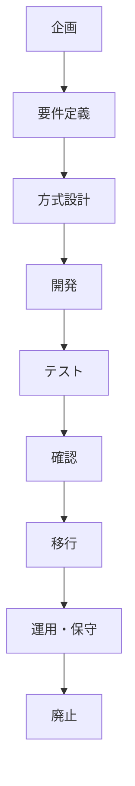

---

# ソフトウェアライフサイクルプロセスと各工程の評価基準

## 1. ソフトウェアライフサイクルプロセスの概要

### 1.1. 定義と標準規格
ソフトウェアライフサイクルプロセスとは、ソフトウェアが企画されてから開発、運用、保守を経て、最終的に廃止されるまでの一連の工程（ライフサイクル）を管理するための枠組みです。このプロセスを定義することで、各工程での誤りが次工程に波及することを防ぎ、品質を確保します。

*   **JIS X 0160 (ISO/IEC 12207):** ソフトウェアライフサイクルプロセスの国際規格。
*   **共通フレーム2013:** 日本におけるソフトウェアライフサイクルの標準。IPA（情報処理推進機構）が公開しており、JIS X 0160に対応しています。

### 1.2. プロセスの全体像
ソフトウェア開発は、企画から始まり、要件定義、設計、開発、テスト、運用・保守、廃止という流れで進みます。前工程の成果物を基に次工程が進められるため、各プロセスで明確な目的と評価基準を定めることが重要です。

## 2. 主要プロセスの目的と評価基準

### 2.1. 企画プロセス
*   **目的:** システム化の目的や範囲を明確にし、事業戦略との整合性を確認します。
*   **評価基準の例:**
    *   事業目的・事業戦略との整合性

### 2.2. 要件定義プロセス
利害関係者のニーズを収集し、システムが実現すべき機能や性能を定義する重要な工程です。

#### 2.2.1. 利害関係者要求の収集・分析
*   **目的:** システムに関わる利害関係者（ステークホルダー）のニーズを収集し、その内容を分析します。
*   **評価基準の例:**
    *   収集した要求の完全性、一貫性

#### 2.2.2. システム要求事項分析（システム要件定義）
*   **目的と位置づけ:**
    *   利害関係者の要求（取得ニーズ）を基に、システムが実現すべき具体的な機能・性能・制約事項（システム要求事項）を定義するプロセスです。
    *   共通フレーム2013における**「システム要件定義プロセス」**に相当します。
    *   利害関係者の言葉は「高速に動作してほしい」のように曖昧・不完全な場合が多いため、「応答時間1秒以内」といった具体的なシステム要求に落とし込む（翻訳する）ことが求められます。
*   **評価基準:**
    定義されたシステム要求事項が正しく、実現可能で、利害関係者のニーズと一致しているかを以下の基準で評価します。
    *   **取得ニーズとの一貫性:** システム要求が、元となる利害関係者の要求（取得ニーズ）から逸脱していないか。
    *   **取得ニーズの追跡可能性:** どの利害関係者要求から、このシステム要求が生まれたのかを追跡できるか。
    *   **テスト可能性:** 定義された要求が、後の工程でテストによって検証可能であるか。
    *   **実現可能性:**
        *   **システム方式設計の実現可能性:** 技術的に設計・実装が可能か。
        *   **運用及び保守の実現可能性:** 運用・保守の観点から見て実現可能か。

#### 2.2.3. ソフトウェア要求分析
*   **目的:** システム要求事項のうち、ソフトウェアによって実現される部分を抽出し、ソフトウェア要求として定義します。
*   **評価基準の例:**
    *   システム要求との整合性

### 2.3. 方式設計プロセス
要件定義で定められた要求を、どのように実現するかの基本的な構造（アーキテクチャ）を決定します。

#### 2.3.1. システム方式設計
*   **目的:** システム全体のハードウェア、ソフトウェア、手作業などを含む全体的な方式を確立します。
*   **評価基準の例:**
    *   **システム要求事項への追跡可能性:** 定義されたすべてのシステム要求が、設計に漏れなく反映されているか。
    *   設計の実現可能性

#### 2.3.2. ソフトウェア方式設計
*   **目的:** ソフトウェアの構成要素やインターフェースなど、ソフトウェア全体の方式を設計します。
*   **評価基準の例:**
    *   ソフトウェア要求への追跡可能性

### 2.4. 開発プロセス（ソフトウェア詳細設計・構築）
*   **目的:** ソフトウェア方式設計に基づき、個々のモジュールを詳細に設計し、プログラミング（実装）を行います。
*   **評価基準の例:**
    *   コーディング規約への適合性
    *   コードレビューの結果

### 2.5. テストプロセス
開発されたソフトウェアやシステムが正しく動作するかを検証します。

#### 2.5.1. ソフトウェア結合・システム結合
*   **目的:**
    *   **ソフトウェア結合:** 開発されたモジュールを結合し、ソフトウェアとして正しく連携して動作するかをテストします。
    *   **システム結合:** ソフトウェアとハードウェアなどを結合し、システム全体として意図通りに動作するかをテストします。
*   **評価基準の例:**
    *   **システム要求事項のテスト網羅性:** すべてのシステム要求事項を網羅するテストが実施されているか。
    *   **使用されたテスト方法及び作業標準の適切性:** 実施されたテストの方法や手順が、定められた標準に準拠しているか。

### 2.6. 確認プロセス
完成したソフトウェアやシステムが、定義された要求を満たしているかを確認します。

#### 2.6.1. ソフトウェア確認
*   **目的:** ソフトウェアが、ソフトウェア要求を満たしていることを確認します。
*   **評価基準の例:**
    *   ソフトウェア要求との整合性、証跡

#### 2.6.2. システム適格性確認テスト
*   **目的:** システム全体が、元々の利害関係者の要求（取得ニーズ）を満たしているかを最終確認（合格判定）します。
*   **評価基準の例:**
    *   利害関係者要求の満足度
    *   要件が正しく満たされているかの網羅性

### 2.7. 移行・運用・保守・廃止プロセス
*   **移行プロセス:** 完成したシステムを本番環境へ導入します。
    *   **評価基準の例:** 移行計画の完了基準との一致
*   **運用プロセス:** システムの安定稼働を維持します。
    *   **評価基準の例:** **SLA（サービスレベル合意）**との整合性（稼働率、応答時間など）
*   **保守プロセス:** 発生した不具合の修正や、機能改善・環境変化への対応を行います。
    *   **評価基準の例:** 修正後の要求適合性
*   **廃止プロセス:** システムを安全に終了させます。
    *   **評価基準の例:** 廃止計画・移行計画への適合性

## 3. 試験対策における要点整理

ソフトウェアライフサイクルプロセスに関する問題では、**「どのプロセスで、どの評価基準が用いられるか」**を正確に理解しているかが問われます。特に混同しやすいポイントを以下に整理します。

### 3.1. プロセスごとの評価基準 比較表
| フェーズ | プロセス | 主な目的 | 評価基準の代表例 |
| :--- | :--- | :--- | :--- |
| **要件定義** | **システム要求事項分析** | システムが実現すべき要求を定義 | **取得ニーズとの一貫性**、テスト可能性、実現可能性 |
| **方式設計** | **システム方式設計** | システム全体の方式を決定 | **システム要求事項への追跡可能性**、設計の実現可能性 |
| **開発** | ソフトウェア設計・構築 | モジュール設計と実装 | コーディング規約適合性、レビュー結果 |
| **テスト** | **システム結合** | ソフトウェアとハードウェアを結合しテスト | **テスト網羅性**、**使用されたテスト方法・標準の適切性** |
| **確認** | **システム適格性確認** | システムが取得ニーズを満たすか確認 | 利害関係者要求の満足度、要件が満たされたかの証跡 |
| **運用** | 運用プロセス | システムの安定稼働 | SLAとの整合性 |

### 3.2. よくある誤解と混同しやすいポイント

#### **ポイント1: 「要求分析」 vs 「テスト工程」の評価基準**
これは最も混同しやすい組み合わせです。
*   **誤解:** 要求を分析するのだから、テストの網羅性も評価するはずだ。
*   **正しい知識:**
    *   **システム要求事項分析**で重要なのは、**「取得ニーズとの一貫性」**です。つまり、利害関係者の要望からズレていないかを確認します。
    *   **「テスト網羅性」**や**「テスト方法の適切性」**は、実際にモノが作られた後の**システム結合プロセス**などのテスト工程で用いられる評価基準です。

#### **ポイント2: 「一貫性」 vs 「追跡可能性」の適用プロセス**
どちらも要求に関連する用語ですが、評価するプロセスが異なります。
*   **誤解:** 追跡可能性は最初から最後まで重要なので、要求分析の基準でもある。
*   **正しい知識:**
    *   **システム要求事項分析**では、利害関係者要求との**「一貫性」**が特に重視されます。
    *   **システム方式設計**では、システム要求を漏れなく設計に反映させるため、システム要求事項への**「追跡可能性」**が重要な評価基準となります。

### 3.3. Q&Aによる知識確認

**Q1. システム要求事項分析プロセスで最も重視される評価基準は？**
**A1.** **取得ニーズとの一貫性**
*(解説: このプロセスの本来の目的は、システム要求が利害関係者の要求を満たしているかを確認することだからです。)*

**Q2. 「テスト網羅性」や「使用されたテスト方法・標準の適切性」が評価基準となるのはどの工程？**
**A2.** **システム結合プロセス**
*(解説: 結合したシステムを網羅的にテストし、そのテスト自体の品質を保証する段階で用いる基準だからです。)*

**Q3. システム方式設計プロセスにおける主要な評価基準は？**
**A3.** **システム要求事項への追跡可能性**
*(解説: 設計が、定義された全ての要求を漏れなく実現しているかを確認するためです。)*

**Q4. システム適格性確認プロセスの目的は？**
**A4.** **システムが利害関係者要求（取得ニーズ）を満たすことを確認する**
*(解説: 開発されたシステムが、最終的に顧客や利用者の満足度を満たしているかを評価する最終確認の工程だからです。)*

**Q5. 運用プロセスで重視される評価基準は？**
**A5.** **SLA（サービスレベル合意）との整合性**
*(解説: 稼働率や応答時間など、サービス提供者と利用者の間で合意した運用目標が守られているかを評価するためです。)*