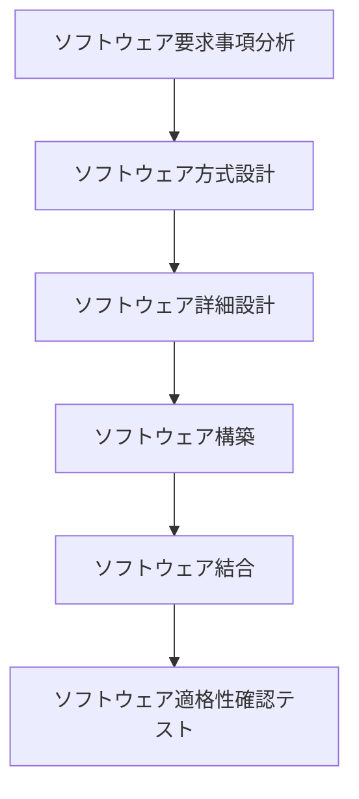

---

## JIS X 0160：ソフトウェア実装プロセスの体系的解説

本ドキュメントは、情報処理技術者試験の問題を基に、JIS X 0160で定義される「ソフトウェア実装プロセス」とその下位プロセスについて、構造的かつ網羅的に解説します。

### 対象となる問題（平成28年秋期 問48）

JIS X 0160におけるソフトウェア実装プロセスの下位レベルのプロセスのうち、次のタスクを実施するものはどれか。

**〔タスク〕**
- ソフトウェア品目の外部インタフェース、及びソフトウェアコンポーネント間のインタフェースについて**最上位レベルの設計**を行う。
- データベースについて**最上位レベルの設計**を行う。
- ソフトウェア結合のために**暫定的なテスト要求事項及びスケジュールを定義**する。

**〔選択肢〕**
ア．ソフトウェア結合プロセス  
イ．ソフトウェア構築プロセス  
ウ．ソフトウェア詳細設計プロセス  
エ．ソフトウェア方式設計プロセス  

（正解：エ）

---

## ソフトウェア実装プロセスの全体像

### JIS X 0160とは
**JIS X 0160**は、ソフトウェア製品の開発ライフサイクルのプロセスを定義した日本の産業規格です。この規格における「ソフトウェア実装プロセス」は、指定されたシステム要素をソフトウェア製品やサービスとして作り出すことを目的としています。

### 6つの下位プロセス
ソフトウェア実装プロセスは、以下の6つの下位プロセスから構成されます。これらは、共通フレームにおける開発プロセスの「ソフトウェア要件定義」から「ソフトウェア適格性確認テスト」に相当します。

1.  **ソフトウェア要求事項分析プロセス**
2.  **ソフトウェア方式設計プロセス**
3.  **ソフトウェア詳細設計プロセス**
4.  **ソフトウェア構築プロセス**
5.  **ソフトウェア結合プロセス**
6.  **ソフトウェア適格性確認テストプロセス**

---

## 各下位プロセスの詳細解説

### ソフトウェア要求事項分析プロセス
システムのソフトウェア要素に求められる要求事項を確立するプロセスです。具体的にどのような機能や性能が必要かを定義します。

### ソフトウェア方式設計プロセス【本問の焦点】
#### 主なタスクと定義
要求事項をソフトウェアコンポーネントに割り当て、それらを実装し検証できる**最上位レベルの設計**を提供するプロセスです。ソフトウェア全体の骨格を決定する重要な工程です。

「**方式**」とは、システムやソフトウェアの「**仕組み**」や「**アーキテクチャ**」を意味します。

#### 「方式設計」の重要性
システムの要求をソフトウェアとして実現する際、いきなり詳細な設計（コーディング）に入ると、全体の整合性が取れなくなり破綻するリスクがあります。

まず全体の枠組み（コンポーネント間のインタフェース、データベース構造、モジュール分割など）を設計することで、後続の詳細設計や構築が一貫性を保って進められるようになります。

### ソフトウェア詳細設計プロセス
ソフトウェア方式設計で定義された各コンポーネントを、**コーディング可能なレベル**まで詳細化するための設計を提供するプロセスです。

方式設計が「上位設計」と位置づけられるのに対し、詳細設計は「下位設計」と整理されます。

### ソフトウェア構築プロセス
ソフトウェア設計を適切に反映した、**実行可能なソフトウェアユニット**を作り出すプロセスです。一般的にプログラミングやコーディング、単体テストがこの工程に含まれます。

### ソフトウェア結合プロセス
ソフトウェアユニット及び構成部品を組み合わせ、**結合されたソフトウェア品目**を作り出すプロセスです。結合テストの計画や実施もここに含まれます。

### ソフトウェア適格性確認テストプロセス
結合されたソフトウェア製品が、その**定義された要求事項を満たすこと**を確認するプロセスです。システム要件と照合し、製品としての品質を保証します。

---

## 主要プロセスの比較と試験対策

### 【比較表】プロセスごとの役割とキーワード
各プロセスの役割、対象の粒度、そして試験で問われるキーワードを以下の表にまとめます。

| プロセス | 主な対象 | 粒度 | 出題キーワード |
| :--- | :--- | :--- | :--- |
| **方式設計** | コンポーネント・DB・外部IF | **最上位レベル** | アーキテクチャ, 分割, インタフェース |
| **詳細設計** | モジュール内部の処理 | **コーディング可能** | データ構造, アルゴリズム |
| **構築** | 実装（プログラミング） | ソースコード | 単体テストも含む |
| **結合** | ソフトウェアユニット | 複数を結合 | 結合テスト, スケジュール |
| **適格性確認テスト** | 製品全体 | 要件との一致 | システム要件に照合 |

### 「方式設計」と「詳細設計」の明確な違い
- **方式設計（上位設計）**:
  - **例**: 「外部インタフェースの最上位設計」「データベースの最上位設計」
- **詳細設計（下位設計）**:
  - **例**: 「モジュール単位のアルゴリズム設計」

### 試験における着眼点とよくある誤解
情報処理技術者試験では、各プロセスの役割を正確に理解しているかが問われます。特に以下の誤解は、出題者が狙うポイントです。

#### 誤解①：「設計＝詳細設計」という思い込み
- **誤解**: 「設計」と聞くと、すぐにコーディング直前の詳細な設計をイメージしてしまう。
- **正しい知識**: 設計は「**方式設計（上位）**」と「**詳細設計（下位）**」の2段階に分かれることを明確に区別する必要があります。問題文の「**最上位レベルの設計**」というキーワードが、方式設計を指す決定的なヒントです。

#### 誤解②：テスト要求事項の定義時期
- **誤解**: 「テスト要求事項」や「結合準備」は、ソフトウェア結合プロセスのタスクだと考えてしまう。
- **正しい知識**: 実際には、後続の結合プロセスを見据え、**ソフトウェア方式設計の段階で暫定的なテスト要求事項やスケジュールを定義する**のがポイントです。

---

## 知識の定着：一問一答

**Q1. ソフトウェア方式設計プロセスで行うのはどれか。**  
A. モジュール内部処理のアルゴリズム設計  
B. ソフトウェア外部インタフェースの最上位設計  

- **答え：B**  
- **解説：** 「最上位設計」は方式設計のタスクです。アルゴリズムの設計は詳細設計に該当します。

**Q2. データベースの正規化やテーブル設計など、最上位レベルのDB設計を行うプロセスはどれか。**  
A. 方式設計  
B. 構築  

- **答え：A**  
- **解説：** データベースの構造設計は、ソフトウェア方式設計の代表的なタスクです。

**Q3. ソフトウェア構築プロセスの成果物はどれか。**  
A. 実行可能なソフトウェアユニット  
B. 最上位の構造図  

- **答え：A**  
- **解説：** 構築プロセスは、コーディングと単体テストを経て、実行可能なユニットを作成します。Bは方式設計の成果物です。

**Q4. ソフトウェア詳細設計プロセスで得られるものはどれか。**  
A. コンポーネント間インタフェース  
B. コーディング可能なモジュール設計  

- **答え：B**  
- **解説：** 詳細設計の目的は、実装直前のレベルまで設計を具体化することです。Aは方式設計で定義されます。

**Q5. ソフトウェア結合プロセスの目的はどれか。**  
A. ソフトウェアユニットを組み合わせ、結合されたソフトウェア品目を作ること  
B. 要求事項をソフトウェアコンポーネントに割り当てること  

- **答え：A**  
- **解説：** Aは結合プロセスの定義そのものです。Bは方式設計のタスクです。

---

## まとめ

- 本問の核心は、「**最上位レベルの設計**」というキーワードが**ソフトウェア方式設計プロセス**を指すことを理解しているかという点にあります。
- 「コーディング可能な設計」を担う**ソフトウェア詳細設計プロセス**との違いを明確に区別することが重要です。
- 設計プロセスは、**方式設計（上位）**と**詳細設計（下位）**の2段階で構成されるという体系的な理解が、正解への鍵となります。