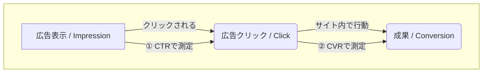

***

# Web広告の効果測定における主要指標ガイド

## 1. はじめに：インターネット広告の特性
インターネット広告は、紙媒体やテレビCMといった従来の広告メディアとは異なり、その効果を具体的な数値で測定できるという大きな特長があります。これは、クッキーなどの技術によってユーザーの行動を一定期間追跡（トラッキング）できるためで、投下した広告費とそれによって得られた成果との関係を明確に数値化することが可能です。

本ドキュメントでは、その効果測定に用いられる主要な指標、特に「コンバージョン率（CVR）」と、それに関連する重要な指標について体系的に解説します。

## 2. Web広告におけるパフォーマンスの全体像
ユーザーが広告に接触してから最終的な成果（購入や登録など）に至るまでには、以下のような段階的なプロセスが存在します。各指標は、このプロセスの異なる段階を測定するために用いられます。

*   **① CTR (クリック率):** 広告がどれだけユーザーの興味を引き、クリックされたかを測ります。
*   **② CVR (コンバージョン率):** クリックしてサイトを訪れたユーザーが、どれだけ最終的な成果に至ったかを測ります。

## 3. 主要指標の定義と計算方法

### 3.1. コンバージョン率 (CVR: Conversion Rate)
**定義**
Webサイト上の広告をクリックして訪れたユーザーのうち、商品購入、会員登録、資料請求といったビジネス上の成果（コンバージョン）に至った顧客数の割合を示す指標です。広告が最終的な成果にどれだけ効率的に結びついたかを測定します。

**計算式**
> **CVR (%) = 成果件数 ÷ クリック回数 × 100**

**計算例**
広告が100回クリックされ、そのうち商品の購入が2回あった場合、コンバージョン率は以下のようになります。
> 2件 ÷ 100回 × 100 = **2%**

### 3.2. CTR (Click Through Rate / クリック率)
**定義**
Webサイト上で広告が表示された回数（インプレッション数）に対して、その広告がクリックされた回数の割合を示す指標です。広告クリエイティブや配信ターゲットが、ユーザーの注意をどれだけ惹きつけられたか（広告の誘引力）を測ります。

**計算式**
> **CTR (%) = クリック回数 ÷ 広告表示回数 × 100**

### 3.3. CPA (Cost Per Acquisition / 顧客獲得単価)
**定義**
成果（コンバージョン）を1件獲得するために、どれだけの広告費がかかったかを示す指標です。**コストの視点**から広告の効率性を測るために用いられ、この値は低い方が効率が良いとされます。

**計算式**
> **CPA (円/件) = 広告費総額 ÷ 成果件数**

### 3.4. ROAS (Return On Advertising Spend / 広告費用対効果)
**定義**
投下した広告費に対して、広告経由でどれだけの売上（収益）を上げられたかを示す指標です。「広告費1円あたりの収益」を表し、**収益の視点**から広告の投資対効果を測ります。この値は高い方が収益性が高いとされます。

**計算式**
> **ROAS = 広告からの収益 ÷ 広告費総額**
> ※パーセンテージで表す場合は100を掛けます。

## 4. 各指標の比較と関係性
これらの指標はそれぞれ異なる側面を評価しており、単体ではなく総合的に見ることで、広告キャンペーンの全体像を正確に把握できます。

| 指標 | 意味 | 計算式の分母 | 計算式の分子 | 単位 | 評価視点 |
| :--- | :--- | :--- | :--- | :--- | :--- |
| **CTR** | 広告の誘引力 | 広告表示回数 | クリック回数 | % | 広告自体の魅力 |
| **CVR** | 広告からの成果率 | クリック回数 | 成果件数 | % | LPやサイトの魅力 |
| **CPA** | 成果1件あたりの費用 | 成果件数 | 広告費総額 | 円/件 | コスト効率 |
| **ROAS** | 広告費の収益効率 | 広告費総額 | 広告からの収益 | 倍率 or % | 収益性 |

## 5. 分析のポイントとよくある誤解
各指標を正しく理解し、組み合わせて分析することが、広告運用の最適化につながります。

*   **CPAは低く、ROASは高い方が良い**
    *   CPAは「コスト」なので低い方が効率的です。ROASは「リターン」なので高い方が収益性が高いと言えます。

*   **CVRとCTRの混同に注意**
    *   `CVR`は「成果率」、`CTR`は「クリック率」であり、評価する対象が異なります。
    *   **誤った計算例：** 広告表示100回、購入2件の場合、CVRを 2/100 = 2% と計算するのは間違いです。CVRの分母は「クリック数」である必要があります。

*   **指標を組み合わせて課題を特定する**
    *   **ケース：** CTRは高いが、CVRが低い。
    *   **考えられる課題：** 広告のメッセージは魅力的でユーザーを惹きつけていますが、クリック後の遷移先ページ（ランディングページ）がユーザーの期待に応えられていない、または購入プロセスに問題がある可能性があります。
    *   **改善アクション：** 広告文とランディングページのメッセージの一貫性を確認し、ページのコンテンツや導線を改善するなどの対策が考えられます。

## 6. 理解度チェック：計算問題（一問一答）

**問1：** 広告が500回表示され、20回クリックされました。このときの**CTR**は？
> **回答：** 4%
> **解説：** 20回 ÷ 500回 × 100 = 4%。CTRは表示回数に対するクリック率です。

**問2：** 広告経由のクリックが100回あり、そのうち成果が5件発生しました。**CVR**は？
> **回答：** 5%
> **解説：** 5件 ÷ 100回 × 100 = 5%。CVRはクリックに対する成果率です。

**問3：** 広告費を10,000円かけ、成果が10件得られました。**CPA**は？
> **回答：** 1,000円/件
> **解説：** 10,000円 ÷ 10件 = 1,000円/件。成果1件あたりにかかる広告費です。

**問4：** 広告費10,000円に対し、広告経由の収益が50,000円でした。**ROAS**は？
> **回答：** 5（または500%）
> **解説：** 50,000円 ÷ 10,000円 = 5。広告費1円あたりの収益が5円であることを示します。